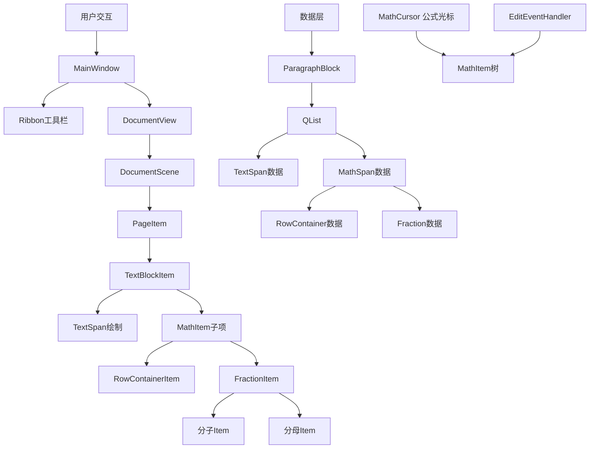

# 基于QtWordEditor的数学公式编辑器完整设计文档（内联InlineSpan + MathItem视图层方案）

**文档版本**: 3.0.0  
**创建日期**: 2026-02-21  
**作者**: QtWordEditor开发团队

---

## 1. 文档概述

### 1.1 项目目标

在现有QtWordEditor文本编辑器的基础上，添加一个**高性能、可扩展的所见即所得(WYSIWYG)数学公式编辑器**。核心需求包括：
- 支持复杂的嵌套公式结构（分数中嵌分数、根号中含矩阵等）
- 公式作为**内联元素**放在字符与字符中间（不是块级公式）
- **真正的所见即所得原地编辑**：鼠标光标可以直接进入分子、分母等公式内部进行编辑
- 与现有文本编辑器无缝集成
- 提供流畅的交互体验（光标导航、键盘输入、鼠标编辑）
- 完整的撤销/重做功能
- 符合数学排版规范（基线对齐、专业符号渲染）

### 1.2 技术选型与设计模式

| 技术 / 模式 | 用途 |
| --- | --- |
| **Qt 6.5+** | 应用程序框架 |
| **QGraphicsView / QGraphicsScene** | 2D图形渲染与交互框架 |
| **Composite (组合) 模式** | 处理公式的树形嵌套结构 |
| **MVC (Model-View) 模式** | 数据层（MathSpan）与视图层（MathItem）分离 |
| **InlineSpan基类** | 统一管理文本和公式内联元素 |
| **现有QtWordEditor架构** | 与文本编辑器集成 |

### 1.3 核心概念

- **InlineSpan**: 所有内联内容的基类（文本和公式数据）
- **TextSpan**: 文本内联元素数据（替换原来的Span）
- **MathSpan**: 公式内联元素数据基类
- **MathItem**: 公式视图基类（继承QGraphicsItem，处理交互）
- **RowContainerMathSpan/RowContainerItem**: 水平行容器
- **FractionMathSpan/FractionItem**: 分数
- **RadicalMathSpan/RadicalItem**: 根号
- **MathCursor**: 公式内部光标
- **Baseline (基线)**: 数学排版中最重要的概念

---

## 2. 系统架构与数据流

### 2.1 整体架构图



### 2.2 关键数据流

1. **用户点击公式**: 鼠标点击TextBlockItem，根据坐标定位到某个MathItem
2. **进入公式编辑模式**: TextBlockItem激活MathCursor，隐藏文本光标
3. **公式内部编辑**: MathCursor在MathItem树中导航，处理键盘输入
4. **修改数据**: MathItem修改对应的MathSpan数据
5. **更新布局**: MathSpan发出变化通知，MathItem调用updateLayout()
6. **同步到文档**: MathSpan变化同步到ParagraphBlock
7. **退出编辑模式**: 用户点击文本区域，切换回文本编辑

---

## 3. 数据模型层设计

### 3.1 InlineSpan 基类设计

**文件位置**:  
`include/core/document/InlineSpan.h`  
`src/core/document/InlineSpan.cpp`

```cpp
#ifndef INLINESPAN_H
#define INLINESPAN_H

#include <QString>
#include <QPointF>
#include <QPainter>
#include "core/Global.h"

namespace QtWordEditor {

/**
 * @brief 所有内联内容的基类（文本和公式）
 * 
 * 这是内联内容系统的基石。TextSpan和MathSpan都继承自此类，
 * 使得文本和公式可以在ParagraphBlock中统一管理。
 */
class InlineSpan
{
public:
    /**
     * @brief 内联内容类型
     */
    enum Type {
        Text,    ///< 文本
        Math     ///< 公式
    };
    
    /**
     * @brief 构造函数
     */
    InlineSpan();
    
    /**
     * @brief 析构函数
     */
    virtual ~InlineSpan() = default;

    // ========== 基本信息 ==========
    
    /**
     * @brief 获取内联内容类型
     * @return Type枚举值
     */
    virtual Type type() const = 0;
    
    /**
     * @brief 获取占用的字符数
     * @return 字符数（TextSpan返回文本长度，MathSpan返回1）
     */
    virtual int length() const = 0;

    // ========== 克隆 ==========
    
    /**
     * @brief 克隆当前内联内容
     * @return 新的InlineSpan指针
     */
    virtual InlineSpan *clone() const = 0;
};

} // namespace QtWordEditor

#endif // INLINESPAN_H
```

### 3.2 TextSpan 类设计（替换原有Span）

**文件位置**:  
`include/core/document/TextSpan.h`  
`src/core/document/TextSpan.cpp`

```cpp
#ifndef TEXTSPAN_H
#define TEXTSPAN_H

#include "InlineSpan.h"
#include "CharacterStyle.h"
#include <QString>
#include <QFont>
#include "core/Global.h"

namespace QtWordEditor {

class TextSpan : public InlineSpan
{
public:
    TextSpan();
    explicit TextSpan(const QString &text);
    TextSpan(const QString &text, const CharacterStyle &style);
    TextSpan(const TextSpan &other);
    ~TextSpan() override;

    Type type() const override { return Text; }
    int length() const override;
    InlineSpan *clone() const override;

    QString text() const;
    void setText(const QString &text);
    void append(const QString &text);
    void insert(int position, const QString &text);
    void remove(int position, int length);

    CharacterStyle style() const;
    void setStyle(const CharacterStyle &style);
    QFont font() const;

private:
    QString m_text;
    CharacterStyle m_style;
    QFont m_font;
};

} // namespace QtWordEditor

#endif // TEXTSPAN_H
```

### 3.3 MathSpan 基类设计

**文件位置**:  
`include/core/document/MathSpan.h`  
`src/core/document/MathSpan.cpp`

```cpp
#ifndef MATHSPAN_H
#define MATHSPAN_H

#include "InlineSpan.h"
#include "core/Global.h"
#include <QObject>

namespace QtWordEditor {

/**
 * @brief 公式内联元素数据基类
 * 
 * 所有公式元素都继承自此类，采用Composite设计模式处理嵌套结构。
 * MathSpan只负责数据存储，不负责渲染。
 */
class MathSpan : public InlineSpan, public QObject
{
    Q_OBJECT
public:
    enum MathType {
        Number,
        Operator,
        RowContainer,
        Fraction,
        Radical,
        SubSup,
        Bracket
    };
    
    MathSpan();
    ~MathSpan() override;

    Type type() const override { return Math; }
    int length() const override { return 1; }
    
    virtual MathType mathType() const = 0;
    virtual bool isContainer() const { return false; }

    // ========== 子项管理 ==========
    virtual void insertChild(int index, MathSpan *item);
    virtual void appendChild(MathSpan *item);
    virtual void removeChild(MathSpan *item);
    virtual QList<MathSpan*> children() const;
    virtual int childCount() const;
    virtual MathSpan *childAt(int index) const;
    virtual int indexOfChild(MathSpan *child) const;
    
    // ========== 父项管理 ==========
    MathSpan *parentMathSpan() const;
    void setParentMathSpan(MathSpan *parent);

signals:
    /**
     * @brief 公式内容发生变化
     */
    void contentChanged();

private:
    MathSpan *m_parent;
};

} // namespace QtWordEditor

#endif // MATHSPAN_H
```

### 3.4 NumberMathSpan（数字/变量数据）

**文件位置**:  
`include/core/document/math/NumberMathSpan.h`  
`src/core/document/math/NumberMathSpan.cpp`

```cpp
#ifndef NUMBERMATHSPAN_H
#define NUMBERMATHSPAN_H

#include "MathSpan.h"
#include <QString>
#include "core/Global.h"

namespace QtWordEditor {

class NumberMathSpan : public MathSpan
{
    Q_OBJECT
public:
    NumberMathSpan();
    explicit NumberMathSpan(const QString &text);
    ~NumberMathSpan() override;

    MathType mathType() const override { return Number; }
    InlineSpan *clone() const override;

    QString text() const;
    void setText(const QString &text);
    void appendChar(QChar ch);
    void removeLastChar();
    int textLength() const;

signals:
    void textChanged(const QString &oldText, const QString &newText);

private:
    QString m_text;
};

} // namespace QtWordEditor

#endif // NUMBERMATHSPAN_H
```

### 3.5 RowContainerMathSpan（行容器数据）

**文件位置**:  
`include/core/document/math/RowContainerMathSpan.h`  
`src/core/document/math/RowContainerMathSpan.cpp`

```cpp
#ifndef ROWCONTAINERMATHSPAN_H
#define ROWCONTAINERMATHSPAN_H

#include "MathSpan.h"
#include <QList>
#include "core/Global.h"

namespace QtWordEditor {

class RowContainerMathSpan : public MathSpan
{
    Q_OBJECT
public:
    RowContainerMathSpan();
    ~RowContainerMathSpan() override;

    MathType mathType() const override { return RowContainer; }
    bool isContainer() const override { return true; }
    InlineSpan *clone() const override;

    void insertChild(int index, MathSpan *item) override;
    void appendChild(MathSpan *item) override;
    void removeChild(MathSpan *item) override;
    QList<MathSpan*> children() const override;
    int childCount() const override;
    MathSpan *childAt(int index) const override;
    int indexOfChild(MathSpan *child) override;

    qreal spacing() const;
    void setSpacing(qreal spacing);

private:
    QList<MathSpan*> m_children;
    qreal m_spacing;
};

} // namespace QtWordEditor

#endif // ROWCONTAINERMATHSPAN_H
```

### 3.6 FractionMathSpan（分数数据）

**文件位置**:  
`include/core/document/math/FractionMathSpan.h`  
`src/core/document/math/FractionMathSpan.cpp`

```cpp
#ifndef FRACTIONMATHSPAN_H
#define FRACTIONMATHSPAN_H

#include "MathSpan.h"
#include "core/Global.h"

namespace QtWordEditor {

class FractionMathSpan : public MathSpan
{
    Q_OBJECT
public:
    FractionMathSpan();
    FractionMathSpan(MathSpan *numerator, MathSpan *denominator);
    ~FractionMathSpan() override;

    MathType mathType() const override { return Fraction; }
    bool isContainer() const override { return true; }
    InlineSpan *clone() const override;

    QList<MathSpan*> children() const override;
    int childCount() const override;
    MathSpan *childAt(int index) const override;

    MathSpan *numerator() const;
    void setNumerator(MathSpan *numerator);
    MathSpan *denominator() const;
    void setDenominator(MathSpan *denominator);

private:
    MathSpan *m_numerator;
    MathSpan *m_denominator;
};

} // namespace QtWordEditor

#endif // FRACTIONMATHSPAN_H
```

### 3.7 ParagraphBlock 修改

**文件位置**:  
`include/core/document/ParagraphBlock.h`  
`src/core/document/ParagraphBlock.cpp`

```cpp
class ParagraphBlock : public Block
{
public:
    // ========== InlineSpan管理（新增）==========
    int inlineSpanCount() const;
    InlineSpan *inlineSpan(int index) const;
    void addInlineSpan(InlineSpan *span);
    void insertInlineSpan(int index, InlineSpan *span);
    void removeInlineSpan(int index);
    void clearInlineSpans();

    // ========== 兼容旧接口（保留）==========
    int spanCount() const;
    Span span(int index) const;
    void addSpan(const Span &span);

    // ========== 重写Block方法 ==========
    int length() const override;
    bool isEmpty() const override;
    Block *clone() const override;

private:
    QList<InlineSpan*> m_inlineSpans;  // 新增
    QList<Span> m_spans;                // 保留
    ParagraphStyle m_paragraphStyle;
};
```

---

## 4. 视图层设计

### 4.1 MathItem 基类设计

**文件位置**:  
`include/graphics/formula/MathItem.h`  
`src/graphics/formula/MathItem.cpp`

```cpp
#ifndef MATHITEM_H
#define MATHITEM_H

#include <QGraphicsItem>
#include <QRectF>
#include <QPainter>
#include "core/Global.h"

namespace QtWordEditor {

class MathSpan;

/**
 * @brief 所有公式视图元素的基类
 * 
 * 继承自QGraphicsItem，可以接收鼠标和键盘事件，实现原地编辑。
 * 每个MathItem对应一个MathSpan数据对象。
 */
class MathItem : public QGraphicsItem
{
public:
    enum { Type = UserType + 2000 };
    
    explicit MathItem(MathSpan *span, MathItem *parent = nullptr);
    virtual ~MathItem() = default;

    // ========== 核心布局接口 ==========
    virtual void updateLayout();
    virtual qreal baseline() const;

    // ========== 子项管理 ==========
    virtual void insertChild(int index, MathItem *item);
    virtual void appendChild(MathItem *item);
    virtual void removeChild(MathItem *item);
    virtual QList<MathItem*> children() const;
    virtual int childCount() const;
    virtual MathItem *childAt(int index) const;
    virtual int indexOfChild(MathItem *child) const;

    // ========== Qt标准接口 ==========
    int type() const override { return Type; }
    QRectF boundingRect() const override = 0;
    void paint(QPainter *painter, const QStyleOptionGraphicsItem *option, QWidget *widget) override = 0;

    // ========== 数据关联 ==========
    MathSpan *mathSpan() const;
    MathItem *parentMathItem() const;
    virtual bool isContainer() const { return false; }

protected:
    void notifyParentLayoutChanged();
    QRectF m_boundingRect;
    qreal m_baseline;
    MathSpan *m_span;
};

} // namespace QtWordEditor

#endif // MATHITEM_H
```

### 4.2 NumberItem（数字/变量视图）

**文件位置**:  
`include/graphics/formula/NumberItem.h`  
`src/graphics/formula/NumberItem.cpp`

```cpp
#ifndef NUMBERITEM_H
#define NUMBERITEM_H

#include "MathItem.h"
#include <QString>
#include <QFont>
#include "core/Global.h"

namespace QtWordEditor {

class NumberMathSpan;

class NumberItem : public MathItem
{
public:
    enum { Type = UserType + 2002 };
    
    NumberItem(NumberMathSpan *span, MathItem *parent = nullptr);
    ~NumberItem() override;

    void updateLayout() override;
    qreal baseline() const override;
    int type() const override { return Type; }
    QRectF boundingRect() const override;
    void paint(QPainter *painter, const QStyleOptionGraphicsItem *option, QWidget *widget) override;

    NumberMathSpan *numberSpan() const;

private:
    QFont m_font;
};

} // namespace QtWordEditor

#endif // NUMBERITEM_H
```

### 4.3 RowContainerItem（行容器视图）

**文件位置**:  
`include/graphics/formula/RowContainerItem.h`  
`src/graphics/formula/RowContainerItem.cpp`

```cpp
#ifndef ROWCONTAINERITEM_H
#define ROWCONTAINERITEM_H

#include "MathItem.h"
#include <QList>
#include <QPointF>
#include "core/Global.h"

namespace QtWordEditor {

class RowContainerMathSpan;

class RowContainerItem : public MathItem
{
public:
    enum { Type = UserType + 2001 };
    
    RowContainerItem(RowContainerMathSpan *span, MathItem *parent = nullptr);
    ~RowContainerItem() override;

    void updateLayout() override;
    qreal baseline() const override;
    int type() const override { return Type; }
    QRectF boundingRect() const override;
    void paint(QPainter *painter, const QStyleOptionGraphicsItem *option, QWidget *widget) override;
    
    void insertChild(int index, MathItem *item) override;
    void appendChild(MathItem *item) override;
    void removeChild(MathItem *item) override;
    QList<MathItem*> children() const override;
    int childCount() const override;
    MathItem *childAt(int index) const override;
    int indexOfChild(MathItem *child) override;
    
    bool isContainer() const override { return true; }
    RowContainerMathSpan *rowSpan() const;

private:
    QList<MathItem*> m_children;
    QList<QPointF> m_childPositions;
    qreal m_spacing;
};

} // namespace QtWordEditor

#endif // ROWCONTAINERITEM_H
```

### 4.4 FractionItem（分数视图）

**文件位置**:  
`include/graphics/formula/FractionItem.h`  
`src/graphics/formula/FractionItem.cpp`

```cpp
#ifndef FRACTIONITEM_H
#define FRACTIONITEM_H

#include "MathItem.h"
#include <QPointF>
#include "core/Global.h"

namespace QtWordEditor {

class FractionMathSpan;

class FractionItem : public MathItem
{
public:
    enum { Type = UserType + 2003 };
    
    FractionItem(FractionMathSpan *span, MathItem *parent = nullptr);
    ~FractionItem() override;

    void updateLayout() override;
    qreal baseline() const override;
    int type() const override { return Type; }
    QRectF boundingRect() const override;
    void paint(QPainter *painter, const QStyleOptionGraphicsItem *option, QWidget *widget) override;
    
    QList<MathItem*> children() const override;
    int childCount() const override;
    MathItem *childAt(int index) const override;
    
    bool isContainer() const override { return true; }
    FractionMathSpan *fractionSpan() const;

    MathItem *numeratorItem() const;
    MathItem *denominatorItem() const;

private:
    MathItem *m_numeratorItem;
    MathItem *m_denominatorItem;
    QPointF m_numPos;
    QPointF m_denPos;
    qreal m_lineY;
    qreal m_lineThickness;
    qreal m_padding;
};

} // namespace QtWordEditor

#endif // FRACTIONITEM_H
```

### 4.5 RadicalItem（根号视图）

**文件位置**:  
`include/graphics/formula/RadicalItem.h`  
`src/graphics/formula/RadicalItem.cpp`

```cpp
#ifndef RADICALITEM_H
#define RADICALITEM_H

#include "MathItem.h"
#include <QPointF>
#include "core/Global.h"

namespace QtWordEditor {

class RadicalMathSpan;

class RadicalItem : public MathItem
{
public:
    enum { Type = UserType + 2004 };
    
    RadicalItem(RadicalMathSpan *span, MathItem *parent = nullptr);
    ~RadicalItem() override;

    void updateLayout() override;
    qreal baseline() const override;
    int type() const override { return Type; }
    QRectF boundingRect() const override;
    void paint(QPainter *painter, const QStyleOptionGraphicsItem *option, QWidget *widget) override;
    
    QList<MathItem*> children() const override;
    int childCount() const override;
    MathItem *childAt(int index) const override;
    
    bool isContainer() const override { return true; }

private:
    MathItem *m_radicandItem;
    MathItem *m_degreeItem;
    QPointF m_radicandPos;
    QPointF m_degreePos;
};

} // namespace QtWordEditor

#endif // RADICALITEM_H
```

### 4.6 SubSupItem（上下标视图）

**文件位置**:  
`include/graphics/formula/SubSupItem.h`  
`src/graphics/formula/SubSupItem.cpp`

```cpp
#ifndef SUPSUPITEM_H
#define SUPSUPITEM_H

#include "MathItem.h"
#include <QPointF>
#include "core/Global.h"

namespace QtWordEditor {

class SubSupMathSpan;

class SubSupItem : public MathItem
{
public:
    enum { Type = UserType + 2005 };
    
    SubSupItem(SubSupMathSpan *span, MathItem *parent = nullptr);
    ~SubSupItem() override;

    void updateLayout() override;
    qreal baseline() const override;
    int type() const override { return Type; }
    QRectF boundingRect() const override;
    void paint(QPainter *painter, const QStyleOptionGraphicsItem *option, QWidget *widget) override;
    
    QList<MathItem*> children() const override;
    int childCount() const override;
    MathItem *childAt(int index) const override;
    
    bool isContainer() const override { return true; }

private:
    MathItem *m_baseItem;
    MathItem *m_superscriptItem;
    MathItem *m_subscriptItem;
};

} // namespace QtWordEditor

#endif // SUPSUPITEM_H
```

---

## 5. 公式光标系统设计

### 5.1 MathCursor 类设计

**文件位置**:  
`include/graphics/formula/MathCursor.h`  
`src/graphics/formula/MathCursor.cpp`

```cpp
#ifndef MATHCURSOR_H
#define MATHCURSOR_H

#include <QGraphicsItem>
#include <QTimer>
#include "core/Global.h"

namespace QtWordEditor {

class MathItem;
class RowContainerItem;

/**
 * @brief 数学公式光标类
 * 
 * 光标在公式内部的MathItem树中导航，提供闪烁的视觉指示器。
 */
class MathCursor : public QGraphicsItem
{
public:
    enum { Type = UserType + 2100 };
    
    explicit MathCursor(QGraphicsItem *parent = nullptr);
    ~MathCursor() override;

    void setPosition(RowContainerItem *container, int position);
    RowContainerItem *currentContainer() const;
    int position() const;

    void moveLeft();
    void moveRight();
    void moveUp();
    void moveDown();
    void moveToParent();

    void setVisible(bool visible);
    void setHeight(qreal height);
    void updateVisualPosition();

    int type() const override { return Type; }
    QRectF boundingRect() const override;
    void paint(QPainter *painter, const QStyleOptionGraphicsItem *option, QWidget *widget) override;

private slots:
    void blink();

private:
    RowContainerItem *m_currentContainer;
    int m_position;
    qreal m_height;
    bool m_visible;
    bool m_blinkState;
    QTimer *m_blinkTimer;
};

} // namespace QtWordEditor

#endif // MATHCURSOR_H
```

---

## 6. TextBlockItem 修改

### 6.1 TextBlockLayoutEngine 修改

**文件位置**:  
`include/graphics/items/TextBlockLayoutEngine.h`

```cpp
struct LayoutItem {
    int spanIndex;
    InlineSpan *span;
    qreal width;
    qreal height;
    qreal ascent;
    qreal descent;
    QPointF position;
    QGraphicsItem *graphicsItem;  // 新增：MathItem或nullptr
};

class TextBlockLayoutEngine
{
public:
    void layout(const QList<InlineSpan*> &spans);
};
```

### 6.2 TextBlockItem 完整修改

**文件位置**:  
`include/graphics/items/TextBlockItem.h`  
`src/graphics/items/TextBlockItem.cpp`

```cpp
class TextBlockItem : public BaseBlockItem
{
public:
    // ... 现有方法 ...

    // ========== 公式编辑模式 ==========
    
    /**
     * @brief 判断是否处于公式编辑模式
     */
    bool isInMathEditMode() const;
    
    /**
     * @brief 进入公式编辑模式
     * @param mathSpan 要编辑的MathSpan
     */
    void enterMathEditMode(MathSpan *mathSpan);
    
    /**
     * @brief 退出公式编辑模式
     */
    void exitMathEditMode();
    
    /**
     * @brief 获取当前编辑的MathItem
     */
    MathItem *currentMathItem() const;
    
    /**
     * @brief 获取公式光标
     */
    MathCursor *mathCursor() const;

    // ========== 事件处理 ==========
    void mousePressEvent(QGraphicsSceneMouseEvent *event) override;
    void mouseMoveEvent(QGraphicsSceneMouseEvent *event) override;
    void mouseReleaseEvent(QGraphicsSceneMouseEvent *event) override;
    void keyPressEvent(QKeyEvent *event) override;
    void focusInEvent(QFocusEvent *event) override;
    void focusOutEvent(QFocusEvent *event) override;

private:
    // ... 现有成员 ...
    
    // ========== 公式编辑相关 ==========
    bool m_inMathEditMode;
    MathItem *m_rootMathItem;
    MathCursor *m_mathCursor;
    QList<QGraphicsItem*> m_mathItems;  // 所有MathItem子项
};
```

**paint()方法修改**：
```cpp
void TextBlockItem::paint(QPainter *painter, const QStyleOptionGraphicsItem *option, QWidget *widget)
{
    Q_UNUSED(option);
    Q_UNUSED(widget);
    
    drawSelectionBackground(painter);
    
    // 只绘制TextSpan，MathItem作为QGraphicsItem子项自动绘制
    painter->save();
    painter->translate(m_leftIndent, 0);
    
    for (const TextBlockLayoutEngine::LayoutItem &item : m_layoutEngine->layoutItems()) {
        if (item.span->type() == InlineSpan::Text) {
            painter->save();
            painter->translate(item.position);
            // 绘制TextSpan...
            painter->restore();
        }
        // MathItem作为子项，自动绘制
    }
    
    painter->restore();
}
```

**updateBlock()方法修改**：
```cpp
void TextBlockItem::updateBlock()
{
    // 清除旧的MathItem
    qDeleteAll(m_mathItems);
    m_mathItems.clear();
    
    // 重新布局
    performLayout();
    
    // 为每个MathSpan创建对应的MathItem
    for (const TextBlockLayoutEngine::LayoutItem &item : m_layoutEngine->layoutItems()) {
        if (item.span->type() == InlineSpan::Math) {
            MathSpan *mathSpan = static_cast<MathSpan*>(item.span);
            MathItem *mathItem = createMathItem(mathSpan);
            mathItem->setParentItem(this);
            mathItem->setPos(item.position);
            m_mathItems.append(mathItem);
        }
    }
    
    updateGeometry();
}
```

---

## 7. MathItemFactory 工厂类

**文件位置**:  
`include/graphics/factory/MathItemFactory.h`  
`src/graphics/factory/MathItemFactory.cpp`

```cpp
#ifndef MATHITEMFACTORY_H
#define MATHITEMFACTORY_H

#include "core/Global.h"

namespace QtWordEditor {

class MathSpan;
class MathItem;

class MathItemFactory
{
public:
    static MathItem *createMathItem(MathSpan *span, MathItem *parent = nullptr);
    
private:
    static MathItem *createNumberItem(MathSpan *span, MathItem *parent);
    static MathItem *createRowContainerItem(MathSpan *span, MathItem *parent);
    static MathItem *createFractionItem(MathSpan *span, MathItem *parent);
    static MathItem *createRadicalItem(MathSpan *span, MathItem *parent);
    static MathItem *createSubSupItem(MathSpan *span, MathItem *parent);
};

} // namespace QtWordEditor

#endif // MATHITEMFACTORY_H
```

---

## 8. 完整架构总结

### 8.1 数据层
```
ParagraphBlock
    └── QList<InlineSpan*>
            ├── TextSpan (text="Hello ", style=...)
            ├── RowContainerMathSpan (data)
            │   ├── NumberMathSpan ("x")
            │   ├── OperatorMathSpan ("+")
            │   └── FractionMathSpan
            │       ├── NumberMathSpan ("1")
            │       └── NumberMathSpan ("2")
            └── TextSpan (text=" World", style=...)
```

### 8.2 视图层
```
TextBlockItem
    ├── TextSpan绘制 (QPainter)
    └── MathItem子项 (QGraphicsItem)
        ├── RowContainerItem
        │   ├── NumberItem
        │   ├── OperatorItem
        │   └── FractionItem
        │       ├── NumberItem (分子)
        │       └── NumberItem (分母)
        └── MathCursor (闪烁光标)
```

### 8.3 交互流程
```
用户点击分数 → TextBlockItem检测到点击MathItem
                ↓
            进入公式编辑模式
                ↓
            显示MathCursor，隐藏文本光标
                ↓
            用户按方向键 → MathCursor在分子/分母间导航
                ↓
            用户输入数字 → 修改NumberMathSpan
                ↓
            NumberItem收到contentChanged信号
                ↓
            updateLayout() → 重绘
```

---

## 9. 文件目录结构

### 9.1 新增文件清单

```
QtWordEditor/
├── include/
│   ├── core/
│   │   └── document/
│   │       ├── InlineSpan.h
│   │       ├── TextSpan.h
│   │       ├── MathSpan.h
│   │       └── math/
│   │           ├── NumberMathSpan.h
│   │           ├── RowContainerMathSpan.h
│   │           ├── FractionMathSpan.h
│   │           ├── RadicalMathSpan.h
│   │           └── SubSupMathSpan.h
│   └── graphics/
│       ├── formula/
│       │   ├── MathItem.h
│       │   ├── MathCursor.h
│       │   ├── NumberItem.h
│       │   ├── RowContainerItem.h
│       │   ├── FractionItem.h
│       │   ├── RadicalItem.h
│       │   └── SubSupItem.h
│       └── factory/
│           └── MathItemFactory.h
│
├── src/
│   ├── core/
│   │   └── document/
│   │       ├── InlineSpan.cpp
│   │       ├── TextSpan.cpp
│   │       ├── MathSpan.cpp
│   │       └── math/
│   │           ├── NumberMathSpan.cpp
│   │           ├── RowContainerMathSpan.cpp
│   │           ├── FractionMathSpan.cpp
│   │           ├── RadicalMathSpan.cpp
│   │           └── SubSupMathSpan.cpp
│   └── graphics/
│       ├── formula/
│       │   ├── MathItem.cpp
│       │   ├── MathCursor.cpp
│       │   ├── NumberItem.cpp
│       │   ├── RowContainerItem.cpp
│       │   ├── FractionItem.cpp
│       │   ├── RadicalItem.cpp
│       │   └── SubSupItem.cpp
│       └── factory/
│           └── MathItemFactory.cpp
```

---

## 10. 实现步骤建议

### 阶段一：基础框架搭建
1. 创建 `InlineSpan` 基类
2. 创建 `TextSpan` 类（替代Span）
3. 修改 `ParagraphBlock` 支持InlineSpan列表
4. 修改 `TextBlockLayoutEngine` 支持InlineSpan

### 阶段二：数据层公式元素
1. 创建 `MathSpan` 基类
2. 创建 `NumberMathSpan`、`RowContainerMathSpan`、`FractionMathSpan`

### 阶段三：视图层MathItem
1. 创建 `MathItem` 基类
2. 创建 `NumberItem`、`RowContainerItem`、`FractionItem`
3. 创建 `MathItemFactory` 工厂

### 阶段四：TextBlockItem集成
1. 修改 `TextBlockItem` 管理MathItem子项
2. 实现 `MathCursor` 公式光标
3. 实现鼠标点击进入公式

### 阶段五：交互系统
1. 实现MathItem鼠标事件处理
2. 实现键盘输入处理
3. 实现光标在公式内部导航
4. 实现分子分母编辑

### 阶段六：UI集成
1. 在Ribbon中添加公式工具栏
2. 实现插入公式的完整流程
3. 测试和优化

---

## 12. AsciiMath 解析器与序列化器

### 12.1 AsciiMath 简介

AsciiMath 是一种简单、易读的数学公式表示法，使用 ASCII 字符表示数学公式。例如：

| 公式 | AsciiMath |
| --- | --- |
| 分数 | a/b 或 a over b |
| 平方根 | sqrt x |
| 上标 | x^2 |
| 下标 | x_2 |
| 求和 | sum_{i=1}^{n} x_i |
| 积分 | int_0^infty f(x) dx |

### 12.2 AsciiMathParser 类设计

**文件位置**:  
`include/core/utils/AsciiMathParser.h`  
`src/core/utils/AsciiMathParser.cpp`

```cpp
#ifndef ASCIIMATHPARSER_H
#define ASCIIMATHPARSER_H

#include "core/Global.h"
#include "core/document/math/MathSpan.h"
#include <QString>
#include <QChar>

namespace QtWordEditor {

class RowContainerMathSpan;

/**
 * @brief AsciiMath 解析器
 * 
 * 使用递归下降解析器将 AsciiMath 字符串解析为 MathSpan 树。
 */
class AsciiMathParser
{
public:
    AsciiMathParser();
    ~AsciiMathParser();

    /**
     * @brief 解析 AsciiMath 字符串
     * @param asciiMath AsciiMath 字符串
     * @return 根 RowContainerMathSpan（失败返回 nullptr）
     */
    RowContainerMathSpan *parse(const QString &asciiMath);

    /**
     * @brief 获取错误信息
     * @return 错误信息字符串
     */
    QString errorMessage() const;

    /**
     * @brief 判断是否有错误
     * @return 有错误返回 true
     */
    bool hasError() const;

private:
    // ========== 递归下降解析方法 ==========
    
    /**
     * @brief 解析表达式（最高优先级）
     */
    MathSpan *parseExpression();
    
    /**
     * @brief 解析项（处理 ^ 和 _）
     */
    MathSpan *parseTerm();
    
    /**
     * @brief 解析因子（处理 / 和 over）
     */
    MathSpan *parseFactor();
    
    /**
     * @brief 解析主表达式（括号、函数、数字等）
     */
    MathSpan *parsePrimary();
    
    /**
     * @brief 解析括号表达式
     */
    MathSpan *parseParentheses();
    
    /**
     * @brief 解析函数（sqrt、sin、cos 等）
     */
    MathSpan *parseFunction();
    
    /**
     * @brief 解析数字或标识符
     */
    MathSpan *parseNumberOrIdentifier();
    
    /**
     * @brief 解析下标或上标
     */
    MathSpan *parseSubSuperscript(MathSpan *base);

    // ========== 词法分析辅助方法 ==========
    
    /**
     * @brief 获取当前字符
     */
    QChar currentChar() const;
    
    /**
     * @brief 消费当前字符，前进到下一个
     */
    void consume();
    
    /**
     * @brief 前瞻 n 个字符
     */
    QChar peek(int n = 1) const;
    
    /**
     * @brief 跳过空白字符
     */
    void skipWhitespace();
    
    /**
     * @brief 匹配特定字符
     */
    bool match(QChar ch);
    
    /**
     * @brief 匹配特定字符串
     */
    bool match(const QString &str);
    
    /**
     * @brief 判断是否到达末尾
     */
    bool atEnd() const;

    // ========== 辅助方法 ==========
    
    /**
     * @brief 设置错误信息
     */
    void setError(const QString &message);
    
    /**
     * @brief 创建行容器
     */
    RowContainerMathSpan *createRowContainer();
    
    /**
     * @brief 创建数字
     */
    MathSpan *createNumber(const QString &text);
    
    /**
     * @brief 创建分数
     */
    MathSpan *createFraction(MathSpan *numerator, MathSpan *denominator);
    
    /**
     * @brief 创建根号
     */
    MathSpan *createRadical(MathSpan *radicand);
    
    /**
     * @brief 创建上下标
     */
    MathSpan *createSubSup(MathSpan *base, MathSpan *superscript, MathSpan *subscript);

private:
    QString m_input;           // 输入字符串
    int m_position;            // 当前解析位置
    QString m_errorMessage;    // 错误信息
    bool m_hasError;           // 是否有错误
};

} // namespace QtWordEditor

#endif // ASCIIMATHPARSER_H
```

### 12.3 AsciiMath 语法规则（简化版）

```
Expression    → Term ( ('+' | '-') Term )*
Term          → Factor ( ('^' | '_') Factor )*
Factor        → Primary ( '/' Primary | 'over' Primary )*
Primary       → Number | Identifier | '(' Expression ')' | Function
Function      → 'sqrt' Primary | 'sin' Primary | 'cos' Primary | ...
Number        → Digit+ ( '.' Digit+ )?
Identifier    → Letter ( Letter | Digit )*
```

### 12.4 解析示例

**输入**: "a/b + sqrt x"

**解析过程**:
```
1. parseExpression()
   ├─ parseTerm()
   │  └─ parseFactor()
   │     ├─ parsePrimary() → Number("a")
   │     ├─ match("/")
   │     └─ parsePrimary() → Number("b")
   │     └─ createFraction(a, b)
   ├─ match("+")
   └─ parseTerm()
      └─ parseFactor()
         └─ parsePrimary()
            └─ parseFunction()
               ├─ match("sqrt")
               └─ parsePrimary() → Number("x")
               └─ createRadical(x)
   
2. 最终结果: RowContainer [ Fraction(a,b), +, Radical(x) ]
```

### 12.5 AsciiMathSerializer 类设计

**文件位置**:  
`include/core/utils/AsciiMathSerializer.h`  
`src/core/utils/AsciiMathSerializer.cpp`

```cpp
#ifndef ASCIIMATHSERIALIZER_H
#define ASCIIMATHSERIALIZER_H

#include "core/Global.h"
#include "core/document/math/MathSpan.h"
#include <QString>

namespace QtWordEditor {

/**
 * @brief AsciiMath 序列化器
 * 
 * 将 MathSpan 树序列化为 AsciiMath 字符串。
 */
class AsciiMathSerializer
{
public:
    AsciiMathSerializer();
    ~AsciiMathSerializer();

    /**
     * @brief 序列化 MathSpan 树为 AsciiMath
     * @param root 根 MathSpan（通常是 RowContainerMathSpan）
     * @return AsciiMath 字符串
     */
    QString serialize(MathSpan *root);

private:
    // ========== 序列化各个 MathSpan 类型 ==========
    
    /**
     * @brief 序列化 RowContainerMathSpan
     */
    QString serializeRowContainer(MathSpan *span);
    
    /**
     * @brief 序列化 NumberMathSpan
     */
    QString serializeNumber(MathSpan *span);
    
    /**
     * @brief 序列化 FractionMathSpan
     */
    QString serializeFraction(MathSpan *span);
    
    /**
     * @brief 序列化 RadicalMathSpan
     */
    QString serializeRadical(MathSpan *span);
    
    /**
     * @brief 序列化 SubSupMathSpan
     */
    QString serializeSubSup(MathSpan *span);
    
    /**
     * @brief 序列化任意 MathSpan（分派到具体类型）
     */
    QString serializeSpan(MathSpan *span);
    
    /**
     * @brief 判断是否需要加括号
     */
    bool needsParentheses(MathSpan *span);
    
    /**
     * @brief 加括号（如果需要）
     */
    QString parenthesize(MathSpan *span);
};

} // namespace QtWordEditor

#endif // ASCIIMATHSERIALIZER_H
```

### 12.6 序列化示例

**MathSpan 树**:
```
RowContainerMathSpan
├─ FractionMathSpan
│  ├─ NumberMathSpan("a")
│  └─ NumberMathSpan("b")
├─ NumberMathSpan("+")
└─ RadicalMathSpan
   └─ NumberMathSpan("x")
```

**输出**: "a/b + sqrt x"

### 12.7 MathSpan 序列化与反序列化方法

**文件位置**:  
`include/core/document/MathSpan.h`

```cpp
class MathSpan : public InlineSpan, public QObject
{
public:
    // ... 现有方法 ...
    
    // ========== 序列化/反序列化 ==========
    
    /**
     * @brief 序列化为 AsciiMath
     * @return AsciiMath 字符串
     */
    QString toAsciiMath() const;
    
    /**
     * @brief 从 AsciiMath 解析
     * @param asciiMath AsciiMath 字符串
     * @return 解析是否成功
     */
    static MathSpan *fromAsciiMath(const QString &asciiMath);
    
    /**
     * @brief 序列化为自定义格式（用于存储）
     * @return 序列化字符串
     */
    QString serialize() const;
    
    /**
     * @brief 从自定义格式反序列化
     * @param data 序列化数据
     * @return 反序列化是否成功
     */
    bool deserialize(const QString &data);
};
```

### 12.8 常用 AsciiMath 符号映射

| 数学符号 | AsciiMath | 说明 |
| --- | --- | --- |
| + | + | 加号 |
| - | - | 减号 |
| × | * or times | 乘号 |
| ÷ | / or div | 除号 |
| = | = | 等于 |
| ≠ | != or ne | 不等于 |
| < | < | 小于 |
| > | > | 大于 |
| ≤ | <= or le | 小于等于 |
| ≥ | >= or ge | 大于等于 |
| ∞ | oo or infty | 无穷大 |
| π | pi | 圆周率 |
| α | alpha | 阿尔法 |
| β | beta | 贝塔 |
| γ | gamma | 伽马 |
| ∑ | sum | 求和 |
| ∫ | int | 积分 |
| √ | sqrt | 平方根 |
| ⌈x⌉ | ceil x | 上取整 |
| ⌊x⌋ | floor x | 下取整 |

### 12.9 括号处理

AsciiMath 支持多种括号：

| 括号类型 | 左括号 | 右括号 | 示例 |
| --- | --- | --- | --- |
| 圆括号 | ( | ) | (a + b) |
| 方括号 | [ | ] | [a, b] |
| 花括号 | { | } | {a, b, c} |
| 绝对值 | \| | \| | \|x\| |
| 向上取整 | lceil | rceil | lceil x rceil |
| 向下取整 | lfloor | rfloor | lfloor x rfloor |

---

## 13. 方案优势总结

✅ **真正的所见即所得** - 鼠标直接点击进入公式内部  
✅ **分子分母原地编辑** - MathItem作为QGraphicsItem接收事件  
✅ **数据视图分离** - MathSpan负责数据，MathItem负责视图  
✅ **MathItem接收鼠标键盘事件** - 支持完整的交互  
✅ **MathCursor公式内部光标** - 在公式树中导航  
✅ **与现有架构完美融合** - TextSpan对应原来的Span  
✅ **公式作为内联元素** - 放在字符与字符中间  
✅ **AsciiMath 输入输出** - 简洁的文本格式，易于存储和交换  
✅ **递归下降解析器** - 简单、高效、易维护  
✅ **完整的序列化支持** - 支持 AsciiMath 和自定义格式  

---

**文档结束**
