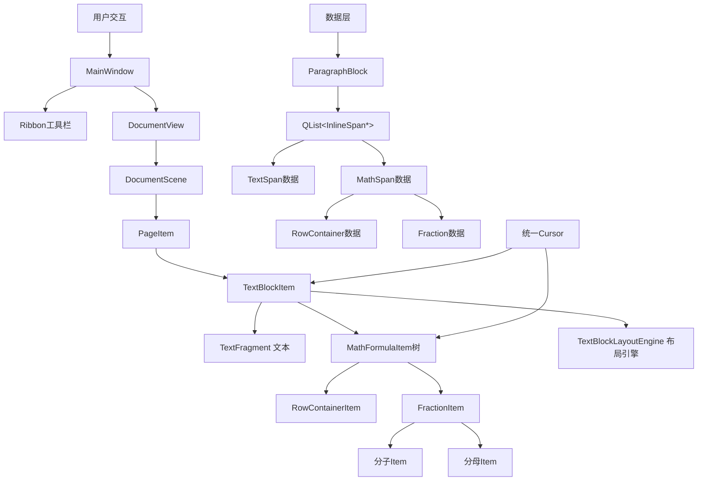

# 基于QtWordEditor的数学公式编辑器完整设计文档（最终方案：混合子项方案 + 统一光标）

**文档版本**: 5.0.0  
**创建日期**: 2026-02-22  
**最后更新**: 2026-02-22  
**作者**: QtWordEditor开发团队

---

## 1. 文档概述

### 1.1 项目目标

在现有QtWordEditor文本编辑器的基础上，添加一个**高性能、可扩展的所见即所得(WYSIWYG)数学公式编辑器**。核心需求包括：
- 支持复杂的嵌套公式结构（分数中嵌分数、根号中含矩阵等）
- 公式作为**内联元素**放在字符与字符中间（不是块级公式）
- **真正的所见即所得原地编辑**：鼠标光标可以直接进入分子、分母等公式内部进行编辑
- 与现有文本编辑器无缝集成
- 提供流畅的交互体验（光标导航、键盘输入、鼠标编辑）
- 完整的撤销/重做功能
- 符合数学排版规范（基线对齐、专业符号渲染）

### 1.2 最终方案确定

经过多轮讨论，最终确定采用**混合子项方案**：

| 组件 | 实现方式 |
|------|---------|
| 文本 | TextFragment（继承QGraphicsItem，自己绘制） |
| 公式 | MathFormulaItem（继承QGraphicsItem，子项架构） |
| 布局 | TextBlockLayoutEngine（统一布局引擎） |

### 1.3 技术选型与设计模式

| 技术 / 模式 | 用途 |
| --- | --- |
| **Qt 6.5+** | 应用程序框架 |
| **QGraphicsView / QGraphicsScene** | 2D图形渲染与交互框架 |
| **Composite (组合) 模式** | 处理公式的树形嵌套结构 |
| **MVC (Model-View) 模式** | 数据层与视图层分离 |
| **InlineSpan基类** | 统一管理文本和公式内联元素 |
| **现有QtWordEditor架构** | 与文本编辑器集成 |

### 1.4 核心概念

- **InlineSpan**: 所有内联内容的基类（文本和公式数据）
- **TextSpan**: 文本内联元素数据
- **MathSpan**: 公式内联元素数据基类
- **TextFragment**: 文本视图（继承QGraphicsItem，自己绘制）
- **MathFormulaItem**: 公式视图基类（继承QGraphicsItem）
- **RowContainerMathSpan/RowContainerItem**: 水平行容器
- **FractionMathSpan/FractionItem**: 分数
- **RadicalMathSpan/RadicalItem**: 根号
- **统一Cursor**: 同时处理文本和公式的光标（推荐方案）
- **MathCursor**: 公式内部光标（备选方案）
- **Baseline (基线)**: 数学排版中最重要的概念
- **TextBlockLayoutEngine**: 文本块布局引擎

---

## 2. 系统架构与数据流

### 2.1 整体架构图



### 2.2 关键数据流

1. **用户点击**: 鼠标点击TextBlockItem，Qt自动分发事件到TextFragment或MathFormulaItem
2. **统一光标定位**: 根据点击位置，Cursor自动判断是在文本还是公式中
3. **光标导航**: 统一Cursor处理所有方向键，在文本和公式间无缝切换
4. **编辑操作**: Cursor根据位置类型调用相应的编辑方法
5. **修改数据**: 文本修改ParagraphBlock，公式修改MathSpan
6. **更新布局**: 数据变化发出通知，相应Item调用updateLayout()
7. **TextBlockLayoutEngine**: 统一处理文本和公式的布局、基线对齐

---

## 3. 数据模型层设计

### 3.1 InlineSpan 基类设计

**文件位置**:  
`include/core/document/InlineSpan.h`  
`src/core/document/InlineSpan.cpp`

```cpp
#ifndef INLINESPAN_H
#define INLINESPAN_H

#include &lt;QString&gt;
#include &lt;QPointF&gt;
#include &lt;QPainter&gt;
#include "core/Global.h"

namespace QtWordEditor {

/**
 * @brief 所有内联内容的基类（文本和公式）
 * 
 * 这是内联内容系统的基石。TextSpan和MathSpan都继承自此类，
 * 使得文本和公式可以在ParagraphBlock中统一管理。
 */
class InlineSpan
{
public:
    /**
     * @brief 内联内容类型
     */
    enum Type {
        Text,    ///&lt; 文本
        Math     ///&lt; 公式
    };
    
    /**
     * @brief 构造函数
     */
    InlineSpan();
    
    /**
     * @brief 析构函数
     */
    virtual ~InlineSpan() = default;

    // ========== 基本信息 ==========
    
    /**
     * @brief 获取内联内容类型
     * @return Type枚举值
     */
    virtual Type type() const = 0;
    
    /**
     * @brief 获取占用的字符数
     * @return 字符数（TextSpan返回文本长度，MathSpan返回1）
     */
    virtual int length() const = 0;

    // ========== 克隆 ==========
    
    /**
     * @brief 克隆当前内联内容
     * @return 新的InlineSpan指针
     */
    virtual InlineSpan *clone() const = 0;
};

} // namespace QtWordEditor

#endif // INLINESPAN_H
```

### 3.2 TextSpan 类设计

**文件位置**:  
`include/core/document/TextSpan.h`  
`src/core/document/TextSpan.cpp`

```cpp
#ifndef TEXTSPAN_H
#define TEXTSPAN_H

#include "InlineSpan.h"
#include "CharacterStyle.h"
#include &lt;QString&gt;
#include &lt;QFont&gt;
#include "core/Global.h"

namespace QtWordEditor {

class TextSpan : public InlineSpan
{
public:
    TextSpan();
    explicit TextSpan(const QString &amp;text);
    TextSpan(const QString &amp;text, const CharacterStyle &amp;style);
    TextSpan(const TextSpan &amp;other);
    ~TextSpan() override;

    Type type() const override { return Text; }
    int length() const override;
    InlineSpan *clone() const override;

    QString text() const;
    void setText(const QString &amp;text);
    void append(const QString &amp;text);
    void insert(int position, const QString &amp;text);
    void remove(int position, int length);

    CharacterStyle style() const;
    void setStyle(const CharacterStyle &amp;style);
    QFont font() const;

private:
    QString m_text;
    CharacterStyle m_style;
    QFont m_font;
};

} // namespace QtWordEditor

#endif // TEXTSPAN_H
```

### 3.3 MathSpan 基类设计

**文件位置**:  
`include/core/document/MathSpan.h`  
`src/core/document/MathSpan.cpp`

```cpp
#ifndef MATHSPAN_H
#define MATHSPAN_H

#include "InlineSpan.h"
#include "core/Global.h"
#include &lt;QObject&gt;

namespace QtWordEditor {

/**
 * @brief 公式内联元素数据基类
 * 
 * 所有公式元素都继承自此类，采用Composite设计模式处理嵌套结构。
 * MathSpan只负责数据存储，不负责渲染。
 */
class MathSpan : public InlineSpan, public QObject
{
    Q_OBJECT
public:
    enum MathType {
        Number,
        Operator,
        RowContainer,
        Fraction,
        Radical,
        SubSup,
        Bracket
    };
    
    MathSpan();
    ~MathSpan() override;

    Type type() const override { return Math; }
    int length() const override { return 1; }
    
    virtual MathType mathType() const = 0;
    virtual bool isContainer() const { return false; }

    // ========== 子项管理 ==========
    virtual void insertChild(int index, MathSpan *item);
    virtual void appendChild(MathSpan *item);
    virtual void removeChild(MathSpan *item);
    virtual QList&lt;MathSpan*&gt; children() const;
    virtual int childCount() const;
    virtual MathSpan *childAt(int index) const;
    virtual int indexOfChild(MathSpan *child) const;
    
    // ========== 父项管理 ==========
    MathSpan *parentMathSpan() const;
    void setParentMathSpan(MathSpan *parent);

signals:
    /**
     * @brief 公式内容发生变化
     */
    void contentChanged();

private:
    MathSpan *m_parent;
};

} // namespace QtWordEditor

#endif // MATHSPAN_H
```

### 3.4 NumberMathSpan（数字/变量数据）

**文件位置**:  
`include/core/document/math/NumberMathSpan.h`  
`src/core/document/math/NumberMathSpan.cpp`

```cpp
#ifndef NUMBERMATHSPAN_H
#define NUMBERMATHSPAN_H

#include "MathSpan.h"
#include &lt;QString&gt;
#include "core/Global.h"

namespace QtWordEditor {

class NumberMathSpan : public MathSpan
{
    Q_OBJECT
public:
    NumberMathSpan();
    explicit NumberMathSpan(const QString &amp;text);
    ~NumberMathSpan() override;

    MathType mathType() const override { return Number; }
    InlineSpan *clone() const override;

    QString text() const;
    void setText(const QString &amp;text);
    void appendChar(QChar ch);
    void removeLastChar();
    int textLength() const;

signals:
    void textChanged(const QString &amp;oldText, const QString &amp;newText);

private:
    QString m_text;
};

} // namespace QtWordEditor

#endif // NUMBERMATHSPAN_H
```

### 3.5 RowContainerMathSpan（行容器数据）

**文件位置**:  
`include/core/document/math/RowContainerMathSpan.h`  
`src/core/document/math/RowContainerMathSpan.cpp`

```cpp
#ifndef ROWCONTAINERMATHSPAN_H
#define ROWCONTAINERMATHSPAN_H

#include "MathSpan.h"
#include &lt;QList&gt;
#include "core/Global.h"

namespace QtWordEditor {

class RowContainerMathSpan : public MathSpan
{
    Q_OBJECT
public:
    RowContainerMathSpan();
    ~RowContainerMathSpan() override;

    MathType mathType() const override { return RowContainer; }
    bool isContainer() const override { return true; }
    InlineSpan *clone() const override;

    void insertChild(int index, MathSpan *item) override;
    void appendChild(MathSpan *item) override;
    void removeChild(MathSpan *item) override;
    QList&lt;MathSpan*&gt; children() const override;
    int childCount() const override;
    MathSpan *childAt(int index) const override;
    int indexOfChild(MathSpan *child) override;

    qreal spacing() const;
    void setSpacing(qreal spacing);

private:
    QList&lt;MathSpan*&gt; m_children;
    qreal m_spacing;
};

} // namespace QtWordEditor

#endif // ROWCONTAINERMATHSPAN_H
```

### 3.6 FractionMathSpan（分数数据）

**文件位置**:  
`include/core/document/math/FractionMathSpan.h`  
`src/core/document/math/FractionMathSpan.cpp`

```cpp
#ifndef FRACTIONMATHSPAN_H
#define FRACTIONMATHSPAN_H

#include "MathSpan.h"
#include "core/Global.h"

namespace QtWordEditor {

class FractionMathSpan : public MathSpan
{
    Q_OBJECT
public:
    FractionMathSpan();
    FractionMathSpan(MathSpan *numerator, MathSpan *denominator);
    ~FractionMathSpan() override;

    MathType mathType() const override { return Fraction; }
    bool isContainer() const override { return true; }
    InlineSpan *clone() const override;

    QList&lt;MathSpan*&gt; children() const override;
    int childCount() const override;
    MathSpan *childAt(int index) const override;

    MathSpan *numerator() const;
    void setNumerator(MathSpan *numerator);
    MathSpan *denominator() const;
    void setDenominator(MathSpan *denominator);

private:
    MathSpan *m_numerator;
    MathSpan *m_denominator;
};

} // namespace QtWordEditor

#endif // FRACTIONMATHSPAN_H
```

### 3.7 ParagraphBlock 修改

**文件位置**:  
`include/core/document/ParagraphBlock.h`  
`src/core/document/ParagraphBlock.cpp`

```cpp
class ParagraphBlock : public Block
{
public:
    // ========== InlineSpan管理（新增）==========
    int inlineSpanCount() const;
    InlineSpan *inlineSpan(int index) const;
    void addInlineSpan(InlineSpan *span);
    void insertInlineSpan(int index, InlineSpan *span);
    void removeInlineSpan(int index);
    void clearInlineSpans();

    // ========== 兼容旧接口（保留）==========
    int spanCount() const;
    Span span(int index) const;
    void addSpan(const Span &amp;span);

    // ========== 重写Block方法 ==========
    int length() const override;
    bool isEmpty() const override;
    Block *clone() const override;

private:
    QList&lt;InlineSpan*&gt; m_inlineSpans;  // 新增
    QList&lt;Span&gt; m_spans;                // 保留
    ParagraphStyle m_paragraphStyle;
};
```

---

## 4. 视图层设计

### 4.1 TextFragment 类（文本视图）

**文件位置**:  
`include/graphics/items/TextFragment.h`  
`src/graphics/items/TextFragment.cpp`

```cpp
#ifndef TEXTFRAGMENT_H
#define TEXTFRAGMENT_H

#include &lt;QGraphicsItem&gt;
#include &lt;QString&gt;
#include &lt;QFont&gt;
#include &lt;QColor&gt;
#include "core/document/CharacterStyle.h"
#include "core/Global.h"

namespace QtWordEditor {

/**
 * @brief 文本片段类
 *
 * 自己渲染文本，不使用 QGraphicsTextItem。
 * 负责：
 * 1. 文本测量（宽度、高度、基线）
 * 2. 文本渲染（使用 QPainter）
 * 3. 字符样式应用
 */
class TextFragment : public QGraphicsItem
{
public:
    // 类型 ID
    enum { Type = UserType + 1010 };

    /**
     * @brief 构造函数
     * @param text 文本内容
     * @param style 字符样式
     * @param parent 父图形项指针
     */
    explicit TextFragment(const QString &amp;text, const CharacterStyle &amp;style, 
                          QGraphicsItem *parent = nullptr);
    
    /**
     * @brief 析构函数
     */
    ~TextFragment() override;

    // ========== 文本内容访问 ==========
    
    /**
     * @brief 获取文本内容
     * @return 文本
     */
    QString text() const;
    
    /**
     * @brief 设置文本内容
     * @param text 文本
     */
    void setText(const QString &amp;text);
    
    /**
     * @brief 获取字符样式
     * @return 字符样式
     */
    CharacterStyle style() const;
    
    /**
     * @brief 设置字符样式
     * @param style 字符样式
     */
    void setStyle(const CharacterStyle &amp;style);

    // ========== 尺寸和基线 ==========
    
    /**
     * @brief 获取文本宽度
     * @return 宽度
     */
    qreal width() const;
    
    /**
     * @brief 获取文本高度
     * @return 高度
     */
    qreal height() const;
    
    /**
     * @brief 获取基线位置（从顶部到基线的距离）
     * @return 基线位置
     */
    qreal baseline() const;

    // ========== QGraphicsItem 接口 ==========
    
    int type() const override { return Type; }
    QRectF boundingRect() const override;
    void paint(QPainter *painter, const QStyleOptionGraphicsItem *option, QWidget *widget) override;

private:
    /**
     * @brief 计算文本尺寸（内部方法）
     */
    void calculateSize();
    
    /**
     * @brief 从 CharacterStyle 创建 QFont
     * @param style 字符样式
     * @return QFont
     */
    QFont createFontFromStyle(const CharacterStyle &amp;style) const;

private:
    QString m_text;           ///&lt; 文本内容
    CharacterStyle m_style;   ///&lt; 字符样式
    QFont m_font;             ///&lt; 字体
    QColor m_textColor;       ///&lt; 文本颜色
    QRectF m_boundingRect;    ///&lt; 边界矩形
    qreal m_baseline;         ///&lt; 基线位置
};

} // namespace QtWordEditor

#endif // TEXTFRAGMENT_H
```

### 4.2 MathFormulaItem 基类设计（公式视图）

**文件位置**:  
`include/graphics/formula/MathFormulaItem.h`  
`src/graphics/formula/MathFormulaItem.cpp`

```cpp
#ifndef MATHFORMULAITEM_H
#define MATHFORMULAITEM_H

#include &lt;QGraphicsItem&gt;
#include &lt;QRectF&gt;
#include &lt;QPainter&gt;
#include "core/Global.h"

namespace QtWordEditor {

class MathSpan;

/**
 * @brief 所有公式视图元素的基类
 * 
 * 继承自QGraphicsItem，可以接收鼠标和键盘事件，实现原地编辑。
 * 每个MathFormulaItem对应一个MathSpan数据对象。
 */
class MathFormulaItem : public QGraphicsItem
{
public:
    enum { Type = UserType + 2000 };
    
    explicit MathFormulaItem(MathSpan *span, MathFormulaItem *parent = nullptr);
    virtual ~MathFormulaItem() = default;

    // ========== 核心布局接口 ==========
    virtual void updateLayout();
    virtual qreal baseline() const;

    // ========== 子项管理 ==========
    virtual void insertChild(int index, MathFormulaItem *item);
    virtual void appendChild(MathFormulaItem *item);
    virtual void removeChild(MathFormulaItem *item);
    virtual QList&lt;MathFormulaItem*&gt; children() const;
    virtual int childCount() const;
    virtual MathFormulaItem *childAt(int index) const;
    virtual int indexOfChild(MathFormulaItem *child) const;

    // ========== Qt标准接口 ==========
    int type() const override { return Type; }
    QRectF boundingRect() const override = 0;
    void paint(QPainter *painter, const QStyleOptionGraphicsItem *option, QWidget *widget) override = 0;

    // ========== 数据关联 ==========
    MathSpan *mathSpan() const;
    MathFormulaItem *parentMathItem() const;
    virtual bool isContainer() const { return false; }

protected:
    void notifyParentLayoutChanged();
    QRectF m_boundingRect;
    qreal m_baseline;
    MathSpan *m_span;
};

} // namespace QtWordEditor

#endif // MATHFORMULAITEM_H
```

### 4.3 NumberItem（数字/变量视图）

**文件位置**:  
`include/graphics/formula/NumberItem.h`  
`src/graphics/formula/NumberItem.cpp`

```cpp
#ifndef NUMBERITEM_H
#define NUMBERITEM_H

#include "MathFormulaItem.h"
#include &lt;QString&gt;
#include &lt;QFont&gt;
#include "core/Global.h"

namespace QtWordEditor {

class NumberMathSpan;

class NumberItem : public MathFormulaItem
{
public:
    enum { Type = UserType + 2002 };
    
    NumberItem(NumberMathSpan *span, MathFormulaItem *parent = nullptr);
    ~NumberItem() override;

    void updateLayout() override;
    qreal baseline() const override;
    int type() const override { return Type; }
    QRectF boundingRect() const override;
    void paint(QPainter *painter, const QStyleOptionGraphicsItem *option, QWidget *widget) override;

    NumberMathSpan *numberSpan() const;

private:
    QFont m_font;
};

} // namespace QtWordEditor

#endif // NUMBERITEM_H
```

### 4.4 RowContainerItem（行容器视图）

**文件位置**:  
`include/graphics/formula/RowContainerItem.h`  
`src/graphics/formula/RowContainerItem.cpp`

```cpp
#ifndef ROWCONTAINERITEM_H
#define ROWCONTAINERITEM_H

#include "MathFormulaItem.h"
#include &lt;QList&gt;
#include &lt;QPointF&gt;
#include "core/Global.h"

namespace QtWordEditor {

class RowContainerMathSpan;

class RowContainerItem : public MathFormulaItem
{
public:
    enum { Type = UserType + 2001 };
    
    RowContainerItem(RowContainerMathSpan *span, MathFormulaItem *parent = nullptr);
    ~RowContainerItem() override;

    void updateLayout() override;
    qreal baseline() const override;
    int type() const override { return Type; }
    QRectF boundingRect() const override;
    void paint(QPainter *painter, const QStyleOptionGraphicsItem *option, QWidget *widget) override;
    
    void insertChild(int index, MathFormulaItem *item) override;
    void appendChild(MathFormulaItem *item) override;
    void removeChild(MathFormulaItem *item) override;
    QList&lt;MathFormulaItem*&gt; children() const override;
    int childCount() const override;
    MathFormulaItem *childAt(int index) const override;
    int indexOfChild(MathFormulaItem *child) override;
    
    bool isContainer() const override { return true; }
    RowContainerMathSpan *rowSpan() const;

private:
    QList&lt;MathFormulaItem*&gt; m_children;
    QList&lt;QPointF&gt; m_childPositions;
    qreal m_spacing;
};

} // namespace QtWordEditor

#endif // ROWCONTAINERITEM_H
```

### 4.5 FractionItem（分数视图）

**文件位置**:  
`include/graphics/formula/FractionItem.h`  
`src/graphics/formula/FractionItem.cpp`

```cpp
#ifndef FRACTIONITEM_H
#define FRACTIONITEM_H

#include "MathFormulaItem.h"
#include &lt;QPointF&gt;
#include "core/Global.h"

namespace QtWordEditor {

class FractionMathSpan;

class FractionItem : public MathFormulaItem
{
public:
    enum { Type = UserType + 2003 };
    
    FractionItem(FractionMathSpan *span, MathFormulaItem *parent = nullptr);
    ~FractionItem() override;

    void updateLayout() override;
    qreal baseline() const override;
    int type() const override { return Type; }
    QRectF boundingRect() const override;
    void paint(QPainter *painter, const QStyleOptionGraphicsItem *option, QWidget *widget) override;
    
    QList&lt;MathFormulaItem*&gt; children() const override;
    int childCount() const override;
    MathFormulaItem *childAt(int index) const override;
    
    bool isContainer() const override { return true; }
    FractionMathSpan *fractionSpan() const;

    MathFormulaItem *numeratorItem() const;
    MathFormulaItem *denominatorItem() const;

private:
    MathFormulaItem *m_numeratorItem;
    MathFormulaItem *m_denominatorItem;
    QPointF m_numPos;
    QPointF m_denPos;
    qreal m_lineY;
    qreal m_lineThickness;
    qreal m_padding;
};

} // namespace QtWordEditor

#endif // FRACTIONITEM_H
```

### 4.6 统一光标方案（推荐）

**设计思想**：使用一个统一的 `Cursor` 类同时处理文本和公式编辑，避免两个光标的复杂性。

#### 4.6.1 方案概述

| 特性 | 说明 |
|------|------|
| **统一管理** | 一个 Cursor 类处理所有情况 |
| **无缝切换** | 文本和公式之间平滑导航 |
| **状态一致** | 不会出现两个光标同时显示的问题 |
| **代码简洁** | 减少重复代码 |
| **用户体验好** | 用户感觉不到模式切换 |

#### 4.6.2 扩展 CursorPosition 结构

**文件位置**:  
`include/editcontrol/cursor/Cursor.h`

```cpp
// 光标位置类型
enum class CursorLocationType {
    Text,           // 在普通文本中
    Formula,        // 在公式内部
    FormulaBoundary // 在公式边界（公式与文本之间）
};

// 公式内部位置信息
struct FormulaCursorInfo {
    MathSpan *rootMathSpan;        // 公式根数据
    RowContainerItem *container;    // 当前行容器
    int position;                   // 在容器中的位置
};

struct CursorPosition
{
    int blockIndex = -1;            // 块索引
    int offset = 0;                  // 块内的字符偏移量
    
    // 新增：位置类型
    CursorLocationType locationType = CursorLocationType::Text;
    
    // 新增：公式内部位置（仅当locationType为Formula时有效）
    FormulaCursorInfo formulaInfo;
    
    /**
     * @brief 相等性比较运算符
     * @param other 要比较的另一个光标位置
     * @return 如果两个位置相等返回true
     */
    bool operator==(const CursorPosition &other) const {
        if (blockIndex != other.blockIndex || offset != other.offset)
            return false;
        if (locationType != other.locationType)
            return false;
        if (locationType == CursorLocationType::Formula) {
            return formulaInfo.rootMathSpan == other.formulaInfo.rootMathSpan &&
                   formulaInfo.container == other.formulaInfo.container &&
                   formulaInfo.position == other.formulaInfo.position;
        }
        return true;
    }
    
    /**
     * @brief 不等性比较运算符
     * @param other 要比较的另一个光标位置
     * @return 如果两个位置不等返回true
     */
    bool operator!=(const CursorPosition &other) const {
        return !(*this == other);
    }
};
```

#### 4.6.3 统一 Cursor 类扩展

```cpp
class Cursor : public QObject
{
    Q_OBJECT
public:
    // ... 原有方法保持不变
    
    // ========== 新增：公式编辑相关方法 ==========
    
    /**
     * @brief 判断光标是否在公式中
     */
    bool isInFormula() const;
    
    /**
     * @brief 进入公式编辑
     * @param mathSpan 公式数据
     * @param container 初始行容器
     * @param position 初始位置
     */
    void enterFormula(MathSpan *mathSpan, RowContainerItem *container, int position);
    
    /**
     * @brief 退出公式编辑
     */
    void exitFormula();
    
    // ========== 重写光标移动方法，支持公式内部导航 ==========
    void moveLeft() override;
    void moveRight() override;
    void moveUp() override;
    void moveDown() override;
    
    // ========== 新增：公式内部插入 ==========
    void insertMathChar(const QString &text);
    void insertFraction();
    void insertRadical();
    
signals:
    // ... 原有信号保持不变
    
    /**
     * @brief 进入公式编辑模式
     */
    void enteredFormula(MathSpan *mathSpan);
    
    /**
     * @brief 退出公式编辑模式
     */
    void exitedFormula();
};
```

#### 4.6.4 光标位置计算（从逻辑到视觉）

在 DocumentScene 中，根据位置类型计算视觉位置：

```cpp
QPointF calculateCursorVisualPosition(const CursorPosition &pos)
{
    if (pos.locationType == CursorLocationType::Text) {
        // 原有的文本位置计算逻辑
        return calculateTextCursorPosition(pos);
    } else {
        // 公式内部位置计算
        return calculateFormulaCursorPosition(pos.formulaInfo);
    }
}
```

#### 4.6.5 导航逻辑示例 - moveLeft()

```cpp
void Cursor::moveLeft()
{
    if (m_position.locationType == CursorLocationType::Formula) {
        // 在公式内部
        if (m_position.formulaInfo.position > 0) {
            // 公式内部左移
            m_position.formulaInfo.position--;
        } else {
            // 已在公式开头，检查是否能退出到文本
            if (canExitFormulaToLeft()) {
                exitFormula();
                // 光标移动到公式前的文本位置
                m_position.offset--;
            } else {
                // 移动到父容器
                moveToParentContainer();
            }
        }
    } else {
        // 在文本中，原有逻辑
        if (m_position.offset > 0) {
            m_position.offset--;
            // 检查是否进入公式
            checkAndEnterFormulaIfNeeded();
        }
    }
    emit positionChanged(m_position);
}
```

#### 4.6.6 需要修改的文件

1. `include/editcontrol/cursor/Cursor.h` - 扩展结构和方法
2. `src/editcontrol/cursor/Cursor.cpp` - 实现统一导航逻辑
3. `include/graphics/scene/DocumentScene.h` - 更新位置计算
4. `src/graphics/scene/DocumentScene.cpp` - 实现统一位置计算

---

### 4.7 MathCursor 类设计（备选方案）

**说明**：如果选择双光标方案，使用此设计。统一光标方案更推荐。

**文件位置**:  
`include/graphics/formula/MathCursor.h`  
`src/graphics/formula/MathCursor.cpp`

```cpp
#ifndef MATHCURSOR_H
#define MATHCURSOR_H

#include <QGraphicsItem>
#include <QTimer>
#include "core/Global.h"

namespace QtWordEditor {

class MathFormulaItem;
class RowContainerItem;

/**
 * @brief 数学公式光标类（备选方案）
 * 
 * 光标在公式内部的MathFormulaItem树中导航，提供闪烁的视觉指示器。
 * 注意：推荐使用统一光标方案，此为备选方案。
 */
class MathCursor : public QGraphicsItem
{
public:
    enum { Type = UserType + 2100 };
    
    explicit MathCursor(QGraphicsItem *parent = nullptr);
    ~MathCursor() override;

    void setPosition(RowContainerItem *container, int position);
    RowContainerItem *currentContainer() const;
    int position() const;

    void moveLeft();
    void moveRight();
    void moveUp();
    void moveDown();
    void moveToParent();

    void setVisible(bool visible);
    void setHeight(qreal height);
    void updateVisualPosition();

    int type() const override { return Type; }
    QRectF boundingRect() const override;
    void paint(QPainter *painter, const QStyleOptionGraphicsItem *option, QWidget *widget) override;

private slots:
    void blink();

private:
    RowContainerItem *m_currentContainer;
    int m_position;
    qreal m_height;
    bool m_visible;
    bool m_blinkState;
    QTimer *m_blinkTimer;
};

} // namespace QtWordEditor

#endif // MATHCURSOR_H
```

### 4.8 TextBlockLayoutEngine 类（布局引擎）

**文件位置**:  
`include/graphics/items/TextBlockLayoutEngine.h`  
`src/graphics/items/TextBlockLayoutEngine.cpp`

```cpp
#ifndef TEXTBLOCKLAYOUTENGINE_H
#define TEXTBLOCKLAYOUTENGINE_H

#include &lt;QList&gt;
#include &lt;QRectF&gt;
#include &lt;QPointF&gt;
#include "core/document/ParagraphStyle.h"
#include "core/Global.h"

namespace QtWordEditor {

class TextFragment;
class MathFormulaItem;
class QGraphicsItem;

/**
 * @brief 文本块布局引擎
 *
 * 这是核心布局引擎！负责：
 * 1. 文本测量和换行
 * 2. 文本对齐
 * 3. 基线对齐（专业排版）
 * 4. 对象定位（文本和公式）
 * 5. 计算整体尺寸
 */
class TextBlockLayoutEngine
{
public:
    /**
     * @brief 换行模式
     */
    enum class WrapMode {
        NoWrap,         ///&lt; 不换行
        WordWrap,       ///&lt; 单词换行
        WrapAnywhere    ///&lt; 字符换行
    };

    /**
     * @brief 构造函数
     */
    TextBlockLayoutEngine();
    
    /**
     * @brief 析构函数
     */
    ~TextBlockLayoutEngine();

    // ========== 布局设置 ==========
    
    /**
     * @brief 设置可用宽度
     * @param width 宽度
     */
    void setAvailableWidth(qreal width);
    
    /**
     * @brief 设置段落样式
     * @param style 段落样式
     */
    void setParagraphStyle(const ParagraphStyle &amp;style);
    
    /**
     * @brief 设置换行模式
     * @param mode 换行模式
     */
    void setWrapMode(WrapMode mode);

    // ========== 布局执行 ==========
    
    /**
     * @brief 执行布局
     * @param items 所有内容项（TextFragment + MathFormulaItem）
     */
    void layout(const QList&lt;QGraphicsItem*&gt; &amp;items);
    
    /**
     * @brief 清除布局结果
     */
    void clear();

    // ========== 布局结果获取 ==========
    
    /**
     * @brief 获取计算后的总高度
     * @return 高度
     */
    qreal totalHeight() const;
    
    /**
     * @brief 获取计算后的总宽度
     * @return 宽度
     */
    qreal totalWidth() const;
    
    /**
     * @brief 获取某个项的位置
     * @param item 项指针
     * @return 位置（相对于 TextBlockItem）
     */
    QPointF positionForItem(QGraphicsItem *item) const;
    
    /**
     * @brief 获取所有行的信息
     * @return 行列表
     */
    QList&lt;QRectF&gt; lines() const;

private:
    /**
     * @brief 一行的信息
     */
    struct LineInfo {
        QRectF rect;              ///&lt; 行的矩形
        qreal maxBaseline;        ///&lt; 该行的最大基线（用于对齐）
        QList&lt;QGraphicsItem*&gt; items;  ///&lt; 该行的所有项
    };

    // ========== 内部布局方法 ==========
    
    /**
     * @brief 将项分配到行
     */
    void assignItemsToLines(const QList&lt;QGraphicsItem*&gt; &amp;items);
    
    /**
     * @brief 计算每一行的基线
     */
    void calculateLineBaselines();
    
    /**
     * @brief 应用文本对齐
     */
    void applyAlignment();
    
    /**
     * @brief 定位所有项
     */
    void positionItems();
    
    /**
     * @brief 计算整体尺寸
     */
    void calculateTotalSize();

private:
    qreal m_availableWidth;          ///&lt; 可用宽度
    ParagraphStyle m_paragraphStyle; ///&lt; 段落样式
    WrapMode m_wrapMode;             ///&lt; 换行模式
    
    QList&lt;LineInfo&gt; m_lines;         ///&lt; 所有行的信息
    QHash&lt;QGraphicsItem*, QPointF&gt; m_itemPositions;  ///&lt; 项的位置
    qreal m_totalWidth;              ///&lt; 总宽度
    qreal m_totalHeight;             ///&lt; 总高度
};

} // namespace QtWordEditor

#endif // TEXTBLOCKLAYOUTENGINE_H
```

### 4.8 TextBlockItem 类（完全重写）

**文件位置**:  
`include/graphics/items/TextBlockItem.h`  
`src/graphics/items/TextBlockItem.cpp`

```cpp
#ifndef TEXTBLOCKITEM_H
#define TEXTBLOCKITEM_H

#include "BaseBlockItem.h"
#include &lt;QList&gt;
#include "core/Global.h"

namespace QtWordEditor {

class ParagraphBlock;
class TextFragment;
class MathFormulaItem;
class TextBlockLayoutEngine;
class RowContainerItem;

/**
 * @brief 文本块图形项类（完全重写版）
 *
 * 不再使用 QGraphicsTextItem！完全自己实现：
 * - 文本渲染（TextFragment）
 * - 公式渲染（MathFormulaItem）
 * - 文本布局（TextBlockLayoutEngine）
 * - 内联公式嵌入
 * - 基线对齐（专业排版）
 * - 统一光标支持
 */
class TextBlockItem : public BaseBlockItem
{
public:
    // 类型 ID
    enum { Type = UserType + 1001 };

    /**
     * @brief 构造函数
     * @param block 关联的段落块
     * @param parent 父图形项指针
     */
    explicit TextBlockItem(ParagraphBlock *block, QGraphicsItem *parent = nullptr);
    
    /**
     * @brief 析构函数
     */
    ~TextBlockItem() override;

    // ========== BaseBlockItem 接口 ==========
    
    void updateBlock() override;

    // ========== QGraphicsItem 接口 ==========
    
    int type() const override { return Type; }
    QRectF boundingRect() const override;
    void paint(QPainter *painter, const QStyleOptionGraphicsItem *option, QWidget *widget) override;

    // ========== 统一光标支持 ==========
    
    /**
     * @brief 获取指定文本偏移处的公式（如果有）
     * @param offset 文本偏移量
     * @return MathSpan指针，如果没有公式返回nullptr
     */
    MathSpan *getMathSpanAtOffset(int offset) const;
    
    /**
     * @brief 获取指定公式的文本偏移量
     * @param mathSpan 公式数据
     * @return 文本偏移量
     */
    int getOffsetForMathSpan(MathSpan *mathSpan) const;
    
    /**
     * @brief 获取公式在块坐标中的位置
     * @param mathSpan 公式数据
     * @return 公式的矩形区域
     */
    QRectF getMathSpanRect(MathSpan *mathSpan) const;
    
    /**
     * @brief 获取公式内部的视觉位置
     * @param container 行容器
     * @param position 位置索引
     * @return 视觉位置（块坐标）
     */
    QPointF getFormulaVisualPosition(RowContainerItem *container, int position) const;

private:
    // ========== 内部方法 ==========
    
    /**
     * @brief 从 ParagraphBlock 构建内容项
     */
    void buildContentItems();
    
    /**
     * @brief 清除所有内容项
     */
    void clearContentItems();
    
    /**
     * @brief 执行布局
     */
    void performLayout();

private:
    QList&lt;QGraphicsItem*&gt; m_contentItems;  ///&lt; 所有内容项（TextFragment + MathFormulaItem）
    TextBlockLayoutEngine *m_layoutEngine;  ///&lt; 布局引擎
    
    // ========== 公式映射 ==========
    QHash&lt;MathSpan*, MathFormulaItem*&gt; m_mathItemMap;  ///&lt; MathSpan到视图的映射
    QHash&lt;int, MathSpan*&gt; m_offsetToMathSpanMap;       ///&lt; 文本偏移到MathSpan的映射
};

} // namespace QtWordEditor

#endif // TEXTBLOCKITEM_H
```

---

## 5. MathFormulaItemFactory 工厂类

**文件位置**:  
`include/graphics/factory/MathFormulaItemFactory.h`  
`src/graphics/factory/MathFormulaItemFactory.cpp`

```cpp
#ifndef MATHFORMULAITEMFACTORY_H
#define MATHFORMULAITEMFACTORY_H

#include "core/Global.h"

namespace QtWordEditor {

class MathSpan;
class MathFormulaItem;

class MathFormulaItemFactory
{
public:
    static MathFormulaItem *createMathItem(MathSpan *span, MathFormulaItem *parent = nullptr);
    
private:
    static MathFormulaItem *createNumberItem(MathSpan *span, MathFormulaItem *parent);
    static MathFormulaItem *createRowContainerItem(MathSpan *span, MathFormulaItem *parent);
    static MathFormulaItem *createFractionItem(MathSpan *span, MathFormulaItem *parent);
    static MathFormulaItem *createRadicalItem(MathSpan *span, MathFormulaItem *parent);
    static MathFormulaItem *createSubSupItem(MathSpan *span, MathFormulaItem *parent);
};

} // namespace QtWordEditor

#endif // MATHFORMULAITEMFACTORY_H
```

---

## 6. 完整架构总结

### 6.1 数据层
```
ParagraphBlock
    └── QList&lt;InlineSpan*&gt;
            ├── TextSpan (text="Hello ", style=...)
            ├── RowContainerMathSpan (data)
            │   ├── NumberMathSpan ("x")
            │   ├── OperatorMathSpan ("+")
            │   └── FractionMathSpan
            │       ├── NumberMathSpan ("1")
            │       └── NumberMathSpan ("2")
            └── TextSpan (text=" World", style=...)
```

### 6.2 视图层
```
TextBlockItem
    ├── TextFragment (文本1)
    ├── MathFormulaItem (公式)
    │   └── RowContainerItem
    │       ├── NumberItem
    │       ├── OperatorItem
    │       └── FractionItem
    │           ├── NumberItem (分子)
    │           └── NumberItem (分母)
    └── TextFragment (文本2)

统一Cursor（同时处理文本和公式）
    └── CursorItem（闪烁光标，在DocumentScene中）
```

### 6.3 交互流程
```
用户点击位置 → 统一Cursor判断位置类型
                ↓
    ┌───────────┴───────────┐
    ↓                       ↓
  文本位置                 公式位置
    ↓                       ↓
Cursor设为Text模式    Cursor设为Formula模式
    ↓                       ↓
  原有文本编辑逻辑       公式内部导航
    ↓                       ↓
用户按方向键 → 统一Cursor智能切换文本/公式
                ↓
            编辑操作 → 根据位置类型调用相应方法
                ↓
            数据更新 → ParagraphBlock或MathSpan
                ↓
            updateLayout() → 重绘
```

---

## 7. AsciiMath 解析器与序列化器

### 7.1 AsciiMath 简介

AsciiMath 是一种简单、易读的数学公式表示法，使用 ASCII 字符表示数学公式。例如：

| 公式 | AsciiMath |
| --- | --- |
| 分数 | a/b 或 a over b |
| 平方根 | sqrt x |
| 上标 | x^2 |
| 下标 | x_2 |
| 求和 | sum_{i=1}^{n} x_i |
| 积分 | int_0^infty f(x) dx |

### 7.2 AsciiMathParser 类设计

**文件位置**:  
`include/core/utils/AsciiMathParser.h`  
`src/core/utils/AsciiMathParser.cpp`

```cpp
#ifndef ASCIIMATHPARSER_H
#define ASCIIMATHPARSER_H

#include "core/Global.h"
#include "core/document/math/MathSpan.h"
#include &lt;QString&gt;
#include &lt;QChar&gt;

namespace QtWordEditor {

class RowContainerMathSpan;

/**
 * @brief AsciiMath 解析器
 * 
 * 使用递归下降解析器将 AsciiMath 字符串解析为 MathSpan 树。
 */
class AsciiMathParser
{
public:
    AsciiMathParser();
    ~AsciiMathParser();

    /**
     * @brief 解析 AsciiMath 字符串
     * @param asciiMath AsciiMath 字符串
     * @return 根 RowContainerMathSpan（失败返回 nullptr）
     */
    RowContainerMathSpan *parse(const QString &amp;asciiMath);

    /**
     * @brief 获取错误信息
     * @return 错误信息字符串
     */
    QString errorMessage() const;

    /**
     * @brief 判断是否有错误
     * @return 有错误返回 true
     */
    bool hasError() const;

private:
    // ========== 递归下降解析方法 ==========
    
    MathSpan *parseExpression();
    MathSpan *parseTerm();
    MathSpan *parseFactor();
    MathSpan *parsePrimary();
    MathSpan *parseParentheses();
    MathSpan *parseFunction();
    MathSpan *parseNumberOrIdentifier();
    MathSpan *parseSubSuperscript(MathSpan *base);

    // ========== 词法分析辅助方法 ==========
    
    QChar currentChar() const;
    void consume();
    QChar peek(int n = 1) const;
    void skipWhitespace();
    bool match(QChar ch);
    bool match(const QString &amp;str);
    bool atEnd() const;

    // ========== 辅助方法 ==========
    
    void setError(const QString &amp;message);
    RowContainerMathSpan *createRowContainer();
    MathSpan *createNumber(const QString &amp;text);
    MathSpan *createFraction(MathSpan *numerator, MathSpan *denominator);
    MathSpan *createRadical(MathSpan *radicand);
    MathSpan *createSubSup(MathSpan *base, MathSpan *superscript, MathSpan *subscript);

private:
    QString m_input;           // 输入字符串
    int m_position;            // 当前解析位置
    QString m_errorMessage;    // 错误信息
    bool m_hasError;           // 是否有错误
};

} // namespace QtWordEditor

#endif // ASCIIMATHPARSER_H
```

### 7.3 AsciiMathSerializer 类设计

**文件位置**:  
`include/core/utils/AsciiMathSerializer.h`  
`src/core/utils/AsciiMathSerializer.cpp`

```cpp
#ifndef ASCIIMATHSERIALIZER_H
#define ASCIIMATHSERIALIZER_H

#include "core/Global.h"
#include "core/document/math/MathSpan.h"
#include &lt;QString&gt;

namespace QtWordEditor {

/**
 * @brief AsciiMath 序列化器
 * 
 * 将 MathSpan 树序列化为 AsciiMath 字符串。
 */
class AsciiMathSerializer
{
public:
    AsciiMathSerializer();
    ~AsciiMathSerializer();

    /**
     * @brief 序列化 MathSpan 树为 AsciiMath
     * @param root 根 MathSpan（通常是 RowContainerMathSpan）
     * @return AsciiMath 字符串
     */
    QString serialize(MathSpan *root);

private:
    QString serializeRowContainer(MathSpan *span);
    QString serializeNumber(MathSpan *span);
    QString serializeFraction(MathSpan *span);
    QString serializeRadical(MathSpan *span);
    QString serializeSubSup(MathSpan *span);
    QString serializeSpan(MathSpan *span);
    bool needsParentheses(MathSpan *span);
    QString parenthesize(MathSpan *span);
};

} // namespace QtWordEditor

#endif // ASCIIMATHSERIALIZER_H
```

---

## 8. 文件目录结构

### 8.1 新增文件清单

```
QtWordEditor/
├── include/
│   ├── core/
│   │   └── document/
│   │       ├── InlineSpan.h
│   │       ├── TextSpan.h
│   │       ├── MathSpan.h
│   │       └── math/
│   │           ├── NumberMathSpan.h
│   │           ├── RowContainerMathSpan.h
│   │           ├── FractionMathSpan.h
│   │           ├── RadicalMathSpan.h
│   │           └── SubSupMathSpan.h
│   ├── graphics/
│   │   ├── items/
│   │   │   ├── TextFragment.h
│   │   │   └── TextBlockLayoutEngine.h
│   │   ├── formula/
│   │   │   ├── MathFormulaItem.h
│   │   │   ├── MathCursor.h
│   │   │   ├── NumberItem.h
│   │   │   ├── RowContainerItem.h
│   │   │   ├── FractionItem.h
│   │   │   ├── RadicalItem.h
│   │   │   └── SubSupItem.h
│   │   └── factory/
│   │       └── MathFormulaItemFactory.h
│   └── core/
│       └── utils/
│           ├── AsciiMathParser.h
│           └── AsciiMathSerializer.h
│
├── src/
│   ├── core/
│   │   └── document/
│   │       ├── InlineSpan.cpp
│   │       ├── TextSpan.cpp
│   │       ├── MathSpan.cpp
│   │       └── math/
│   │           ├── NumberMathSpan.cpp
│   │           ├── RowContainerMathSpan.cpp
│   │           ├── FractionMathSpan.cpp
│   │           ├── RadicalMathSpan.cpp
│   │           └── SubSupMathSpan.cpp
│   ├── graphics/
│   │   ├── items/
│   │   │   ├── TextFragment.cpp
│   │   │   ├── TextBlockLayoutEngine.cpp
│   │   │   └── TextBlockItem.cpp (重写)
│   │   ├── formula/
│   │   │   ├── MathFormulaItem.cpp
│   │   │   ├── MathCursor.cpp
│   │   │   ├── NumberItem.cpp
│   │   │   ├── RowContainerItem.cpp
│   │   │   ├── FractionItem.cpp
│   │   │   ├── RadicalItem.cpp
│   │   │   └── SubSupItem.cpp
│   │   └── factory/
│   │       └── MathFormulaItemFactory.cpp
│   └── core/
│       └── utils/
│           ├── AsciiMathParser.cpp
│           └── AsciiMathSerializer.cpp
```

---

## 9. 实现步骤建议

### 阶段一：基础框架搭建
1. 修改 `BaseBlockItem`，继承 `QGraphicsItem`
2. 创建 `InlineSpan` 基类
3. 创建 `TextSpan` 类
4. 修改 `ParagraphBlock` 支持InlineSpan列表

### 阶段二：文本视图实现
1. 创建 `TextFragment` 类（继承QGraphicsItem，自己绘制）
2. 实现文本测量和绘制
3. 创建 `TextBlockLayoutEngine` 布局引擎

### 阶段三：数据层公式元素
1. 创建 `MathSpan` 基类
2. 创建 `NumberMathSpan`、`RowContainerMathSpan`、`FractionMathSpan`

### 阶段四：视图层MathFormulaItem
1. 创建 `MathFormulaItem` 基类
2. 创建 `NumberItem`、`RowContainerItem`、`FractionItem`
3. 创建 `MathFormulaItemFactory` 工厂

### 阶段五：TextBlockItem集成
1. 完全重写 `TextBlockItem`
2. 实现 `buildContentItems()` 从数据创建视图
3. 实现 `performLayout()` 使用布局引擎
4. 实现公式映射（MathSpan到视图、偏移量到MathSpan）
5. 实现统一光标支持方法

### 阶段六：统一光标实现
1. 扩展 `CursorPosition` 结构，支持公式位置
2. 扩展 `Cursor` 类，实现统一光标逻辑
3. 实现文本和公式间的无缝切换
4. 实现公式内部导航
5. 实现分子分母编辑

### 阶段七：AsciiMath支持
1. 实现 `AsciiMathParser` 解析器
2. 实现 `AsciiMathSerializer` 序列化器

### 阶段八：UI集成
1. 在Ribbon中添加公式工具栏
2. 实现插入公式的完整流程
3. 测试和优化

---

## 10. 方案优势总结

✅ **完全一致性** - 文本和公式都是QGraphicsItem子项  
✅ **真正的所见即所得** - 鼠标直接点击进入公式内部  
✅ **分子分母原地编辑** - MathFormulaItem接收鼠标键盘事件  
✅ **数据视图分离** - MathSpan负责数据，MathFormulaItem负责视图  
✅ **事件处理简单** - Qt自动分发事件到正确的子项  
✅ **统一光标** - 一个Cursor同时处理文本和公式，无缝切换  
✅ **无模式切换** - 用户感觉不到文本和公式的区别  
✅ **状态一致** - 不会出现两个光标同时显示的问题  
✅ **完美的基线对齐** - TextBlockLayoutEngine统一处理  
✅ **与现有架构完美融合** - TextSpan对应原来的Span  
✅ **公式作为内联元素** - 放在字符与字符中间  
✅ **AsciiMath 输入输出** - 简洁的文本格式，易于存储和交换  
✅ **模块化设计** - 每个功能都独立成类，易于维护  
✅ **扩展性强** - 新增内容类型只需新增QGraphicsItem子类  

---

## 11. 方案决策历史记录

| 日期 | 决策 | 说明 |
|------|------|------|
| 2026-02-21 | 初始方案：混合绘制 | 文本QPainter绘制，公式MathItem子项 |
| 2026-02-22 | 讨论方案二：完全直接绘制 | 所有内容QPainter绘制，事件处理复杂 |
| 2026-02-22 | 讨论TextFragment继承QGraphicsTextItem | 快速实现但基线对齐难 |
| 2026-02-22 | **最终方案：混合子项** | 文本TextFragment + 公式MathFormulaItem，都是QGraphicsItem子项 |
| 2026-02-22 | **统一光标方案** | 使用一个Cursor同时处理文本和公式，无缝切换 |

---

**文档结束**
