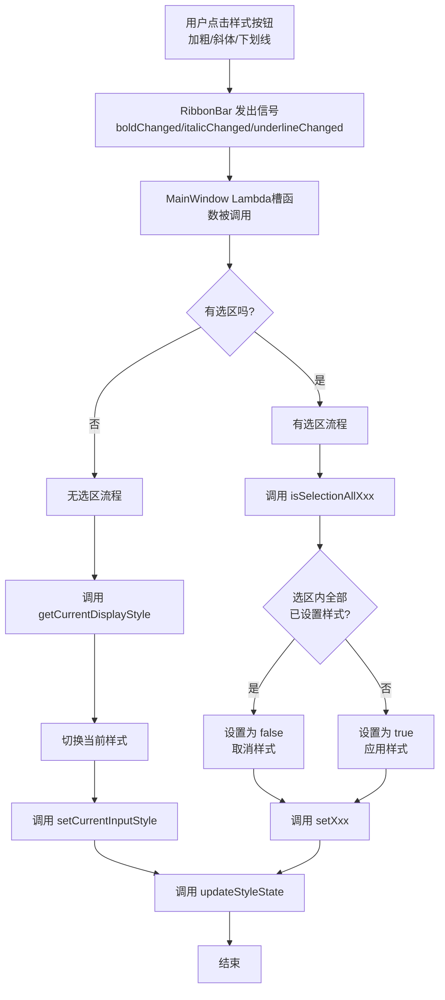
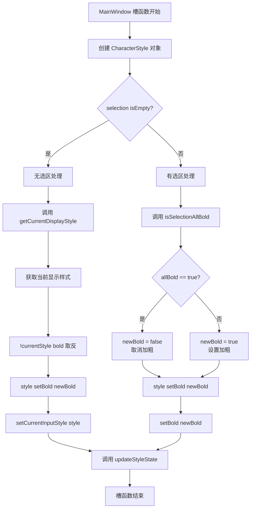
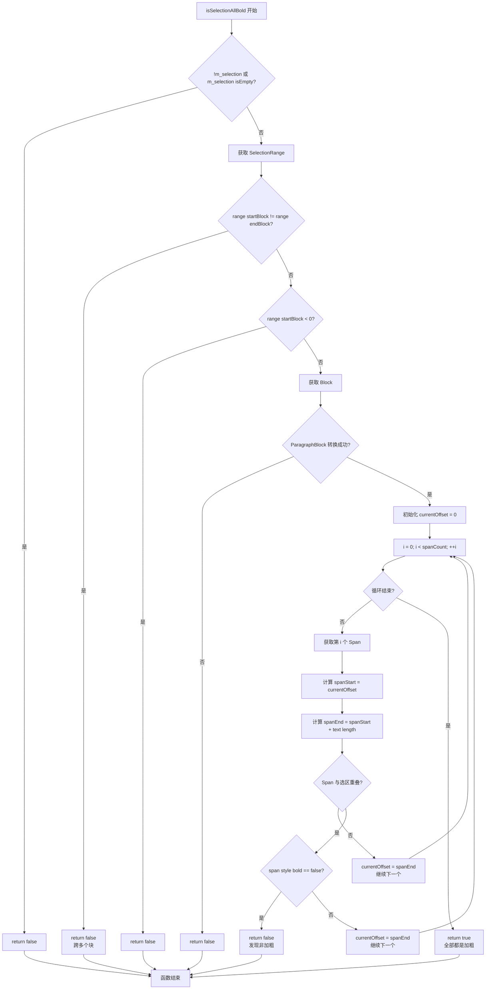
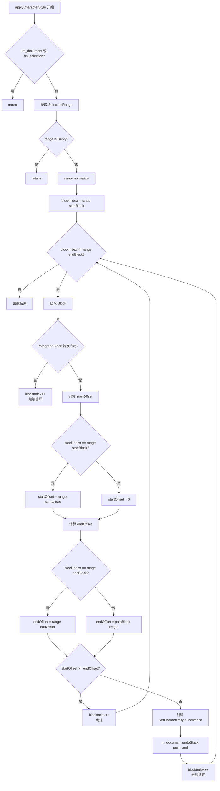
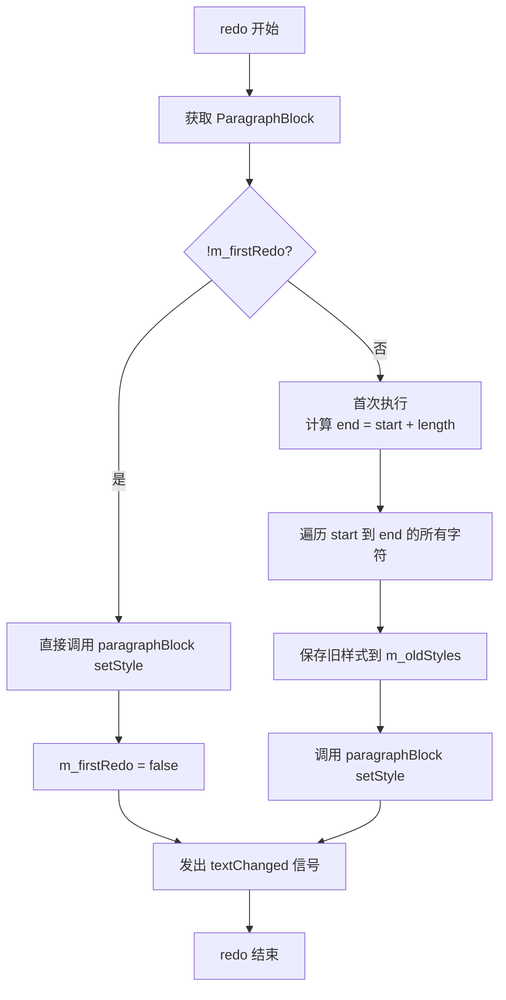
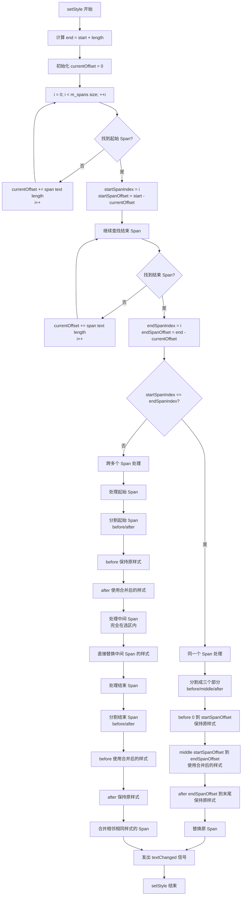
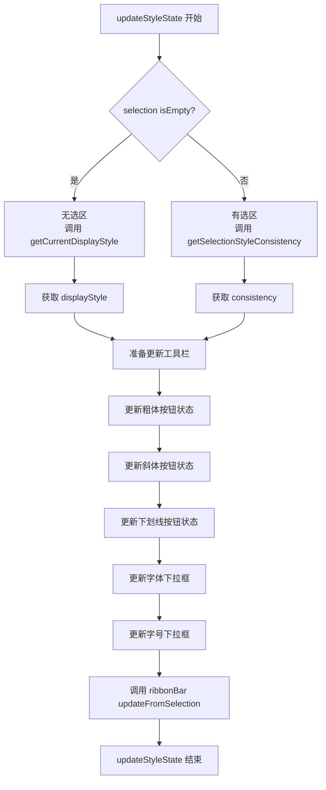
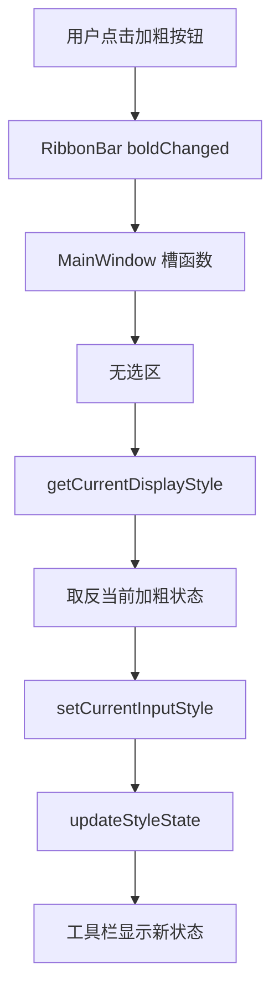
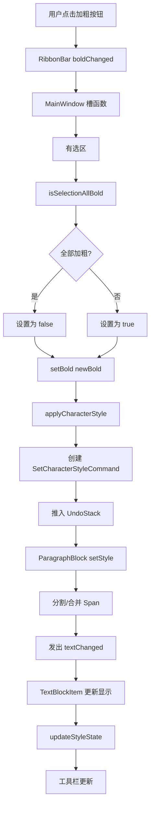
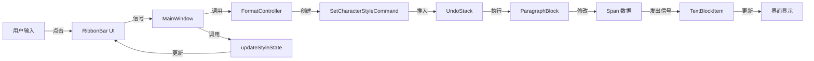

# QtWordEditor 样式按钮点击详细流程图

**日期**: 2026-02-19 14:30:00

---

## 目录
1. [总体流程图](#总体流程图)
2. [MainWindow 处理流程](#mainwindow-处理流程)
3. [isSelectionAllBold() 详细流程](#isselectionallbold-详细流程)
4. [applyCharacterStyle() 详细流程](#applycharacterstyle-详细流程)
5. [SetCharacterStyleCommand::redo() 流程](#setcharacterstylecommandredo-流程)
6. [ParagraphBlock::setStyle() 详细流程](#paragraphblocksetstyle-详细流程)
7. [updateStyleState() 流程](#updatestylestate-流程)

---

## 总体流程图

---

## MainWindow 处理流程

---

## isSelectionAllBold() 详细流程

---

## applyCharacterStyle() 详细流程

---

## SetCharacterStyleCommand::redo() 流程

---

## ParagraphBlock::setStyle() 详细流程

---

## updateStyleState() 流程

---

## 完整流程串联图（无选区情况）

---

## 完整流程串联图（有选区情况）

---

## 关键数据流向图

---

## 总结

本流程图详细展示了从用户点击样式按钮到界面最终更新的完整流程，包括：

1. **主流程**：从用户点击到工具栏更新的完整链路
2. **子流程**：每个关键方法的详细执行步骤
3. **分支处理**：无选区和有选区两种情况的不同处理逻辑
4. **数据流向**：数据在各个组件之间的传递过程

所有流程图都基于实际代码逻辑绘制，可作为开发和调试的参考文档。
